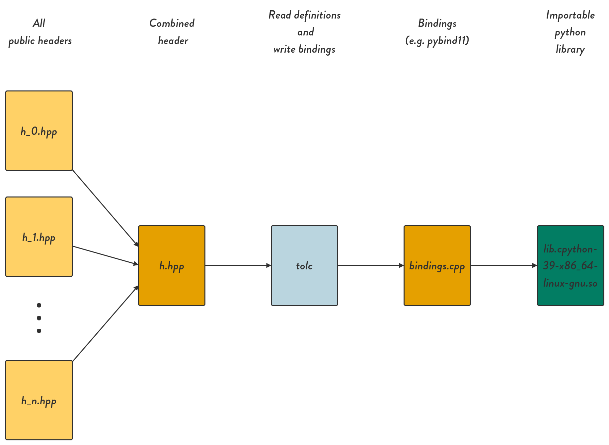

# Tolc demo - Using `C++` from other languages #

 

[Signup to influence the development of `tolc`](https://srydell.github.io/tolc/signup/)

`tolc` is a project aiming to making it effortless to use `C++` from other languages. This demo is meant to show how easy it is to get going and start using existing `C++` libraries from for example `python` with the help of `tolc`.

`tolc` itself is a simple executable that takes one file (typically a `C++` header), and spits out binding code that can be built to provide a bridge from the input to some other language. This demo uses the open beta version of `tolc` and shows the available `CMake` wrappers to translate a library to be used from `python`. A brief overview of the whole process can be seen below:



## Usage ##

### Prerequisites ###

You need the following installed locally:

* `CMake` - Tested with `>3.11`.
* `python` - The language to translate to.

### Building and importing ###

Fork and download this repository.

Go to the root of the project and generate the build files:

```shell
$ cmake -S. -Bbuild
```

This will automatically download `tolc`, and anything needed to build the library for use in `python` (in this case, [the `pybind11` project](https://github.com/pybind/pybind11)).

Build the library:

```shell
$ cmake --build build
```

You should now be able to start using the `C++` library `MyCppLib` from `python`:

```shell
$ cd build/tolc
$ python3
>>> import MyCppLib
>>> MyCppLib.Demo.merge({"tolc": 0}, {"demo": 1})
{'demo': 1, 'tolc': 0}
```

It's that easy!
